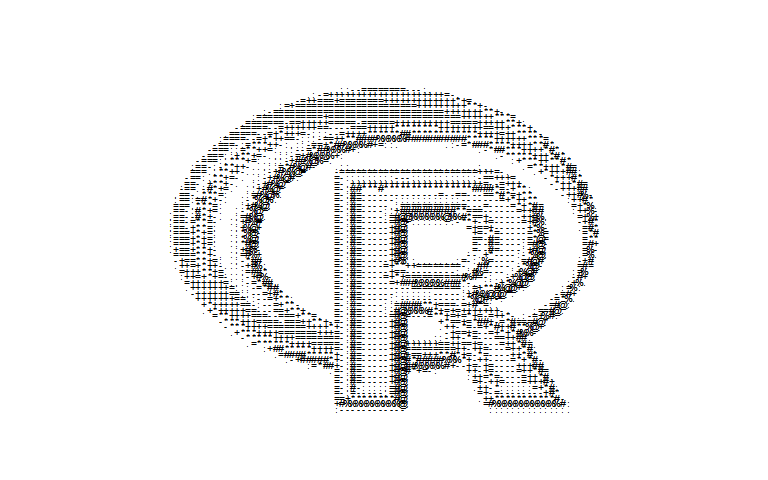

# asciiart

A very quick, very dirty, very simple and very nasty attempt at making
ASCII art in R. Please forgive me.

The output is plotted on a uniform grid. The text printed to the console
is an approxmation of the image, as rows are removed to counteract
vertical stretching. This is not precise. The aspect ratio will not be
the same as that of the original image.

``` r
library(asciiart)
asciiart(asciiart::rstats)
```


